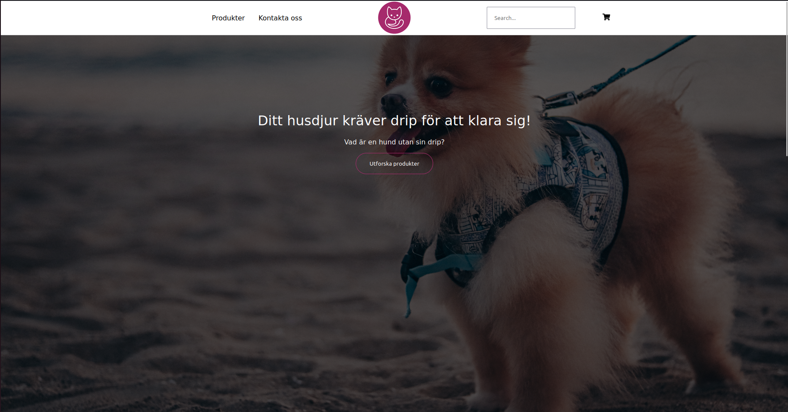
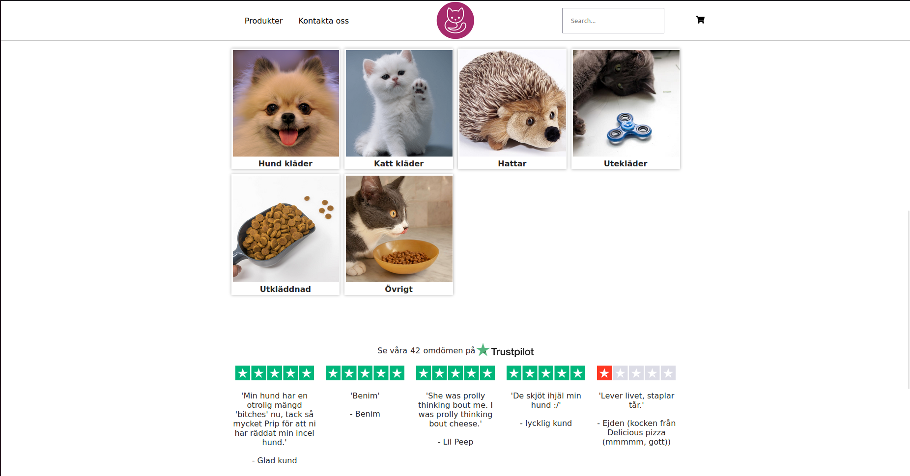
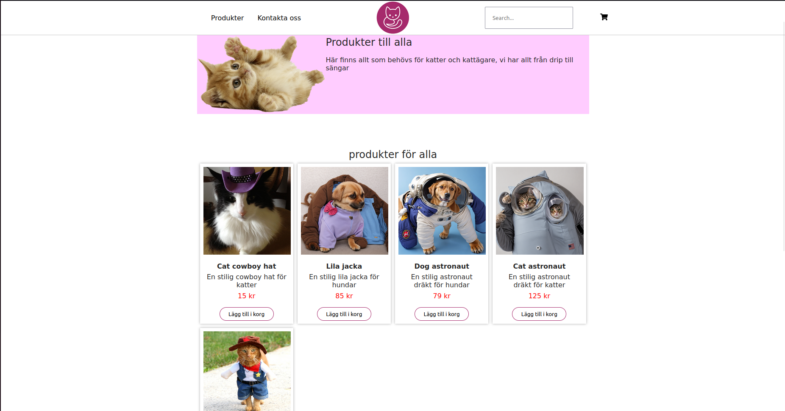
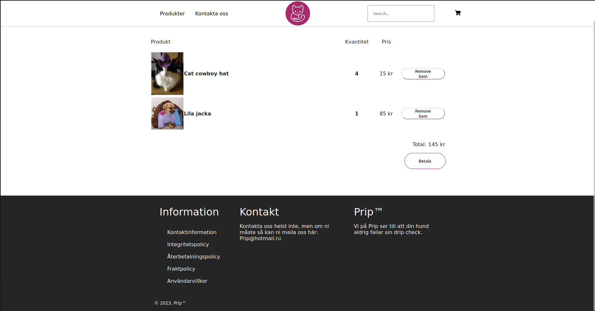

# webbshop 2023 oktober 24- Loke öberg

## Målet

- Syftet med det här var att bättre förstå hur man kan använda databaser på en hemsida. Det var svårt :c. Men jag fick det att funka tillslut

## Arbetsgång

### Databas
Databasen gjordes med hjälp av prisma vilket gör att vi skriver olika modeller som vi kan lägga in värden på. Modeller kan se ut lite hur som helst men i det här projektet ser de ut som koden nedan.
```
generator client {
  provider = "prisma-client-js"
}

datasource db {
  provider = "mysql"
  url      = env("DATABASE_URL")
}

model Item {
  id          Int                 @id @default(autoincrement())
  name        String              @unique
  description String?
  price       Float
  oldPrice    Float?
  image       String?
  categories  CategoriesOnItems[]
  inStock     Int?
  brand       Brand?              @relation(fields: [brandId], references: [id])
  brandId     Int?
}

model Category {
  id    Int                 @id @default(autoincrement())
  name  String              @unique
  items CategoriesOnItems[]
}

model CategoriesOnItems {
  item       Item     @relation(fields: [itemId], references: [id])
  itemId     Int // relation scalar field (used in the `@relation` attribute above)
  category   Category @relation(fields: [categoryId], references: [id])
  categoryId Int // relation scalar field (used in the `@relation` attribute above)

  @@id([itemId, categoryId])
}

model Brand {
  id    Int    @id @default(autoincrement())
  name  String
  items Item[]
}
```
Sedan för att kalla på vissa produkter så gjorde jag flera olika paths för min api vilket såg ut så här.
```
app.get('/', async function (req, res) {
    const allItems = await prisma.item.findMany({
        // orderBy: {
        //     id: 'desc',
        // },


        include: {
            categories: true,
            brand: true,
        }
    })

    res.json({ data: allItems })
})
```

För att lägga till nya produkter i databasen så används den här koden

```
    const item = await prisma.item.create({
        data: {
            name: 'Cat cowboy',
            description: 'En stilig cowboy dräkt för katter',
            price: 15,
            oldPrice: 300,
            image: 'catCowboy.jpg',
            inStock: 4,
            categories: {
                create: [
                    {
                        category: {
                            connectOrCreate: {
                                create: {
                                    name: 'Cat',
                                },
                                where: {
                                    name: 'Cat',
                                },
                            },
                        },
                    },
                    {
                        category: {
                            connectOrCreate: {
                                create: {
                                    name: 'Costume',
                                },
                                where: {
                                    name: 'Costume',
                                },
                            },
                        },
                    },
                ],
            },
        },
    })
```

för att ladda in data från databasen så användes fetch metoden

```
    const [data, setData] = useState([])

    async function fetchData() {
        await fetch('http://localhost:3000')
            .then(res => res.json())
            .then(result => {
                setData(result.data)
                console.log(result.data)
            }).catch(err => {
                console.log(err)
            })
    }
    useEffect(() => {
        fetchData()
    }, [])
```

När jag har fått in data så itererar jag över all data och gör kort för alla produkter

```
                <div id="produkter" className="produkter">
                    {data.map((item) => (
                            < ProductCard
                                key={item.id}
                                id={item.id}
                                image={"../" + item.image}
                                name={item.name}
                                description={item.description}
                                price={item.price}
                            />
                    ))}
                </div>
```
Min landingpage blev väldigt bra, fin navbar och blev väldigt nöjd med heron.

När man skrollar ner från heron eller klickar på "utforska produkter"




## Saker som gick bra
- Det mesta som involverade javascript gick bra, men något som jag inte kunde väldigt bra men ändå gick hyfsat var css. Det hade dock gått ännu bättre om jag hade bättre planering.

## Saker som gick dåligt
- Jag gillar inte att planera så jag gjorde knappt det
- Det blev ingen skiss, jag hade en skiss i huvudet men orkade inte göra en riktig skiss c:

## Saker jag har lärt mig
- Jag har blivit väldigt mycket bättre på css och html, jag lärde mig även väldigt mycket om databaser.